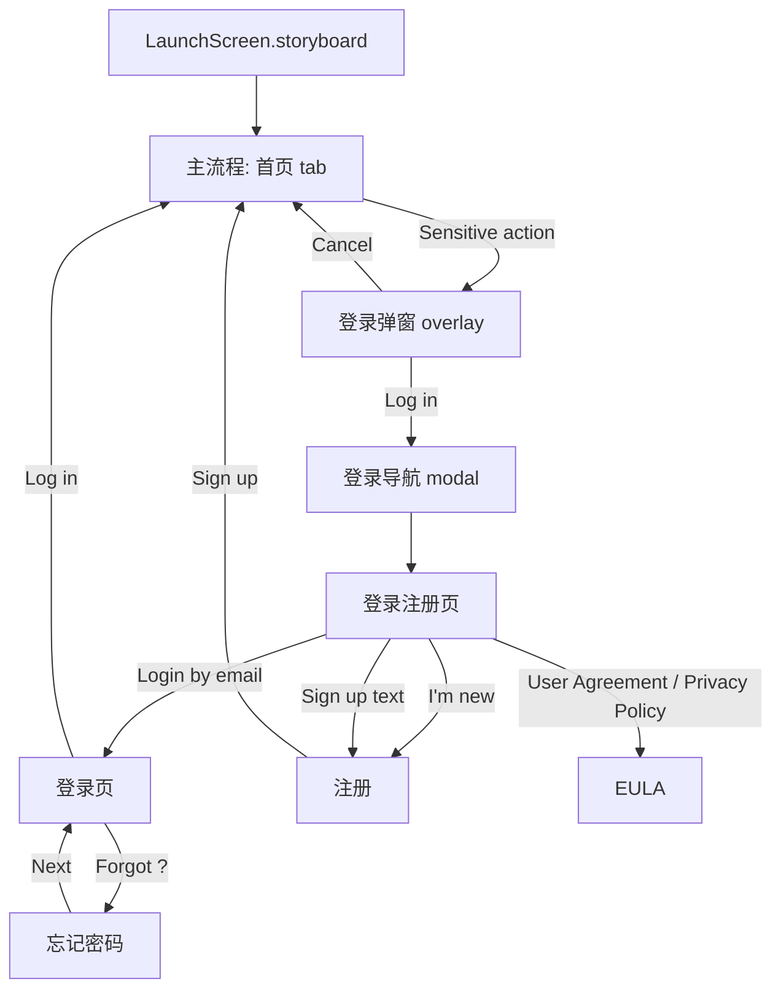
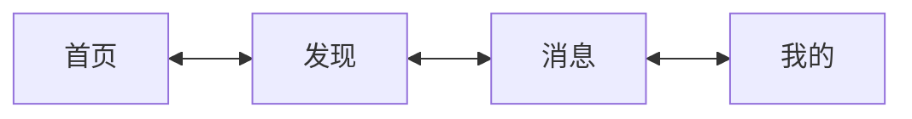
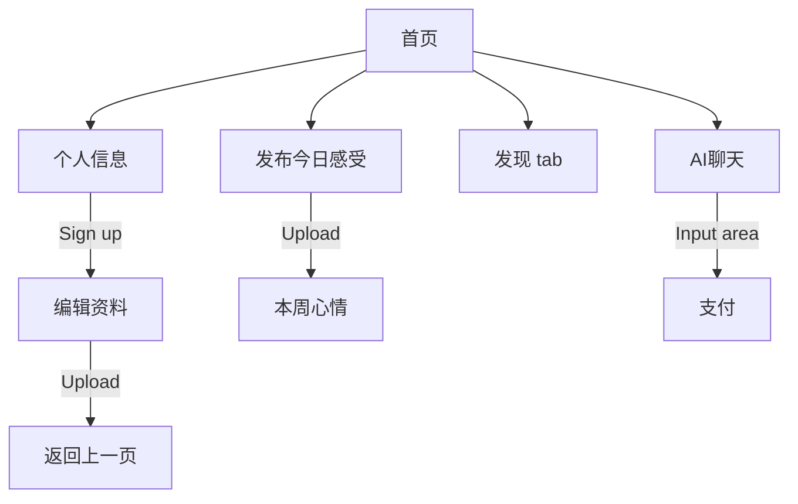
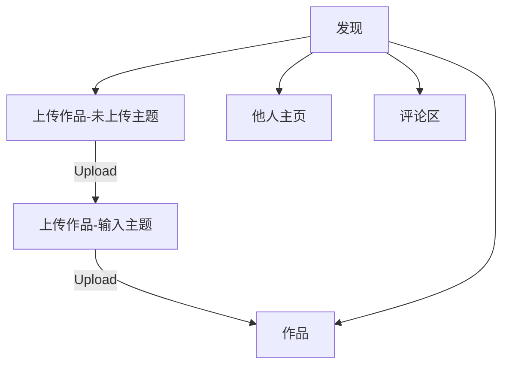
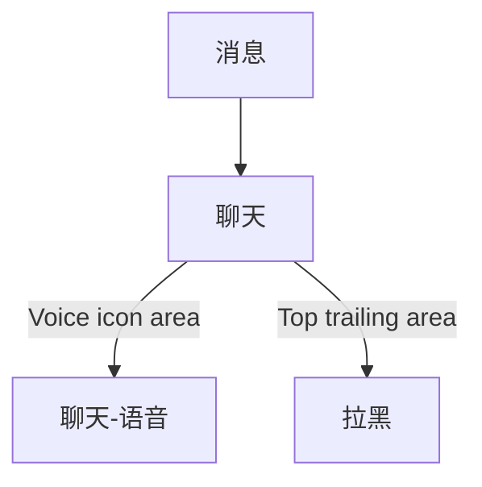
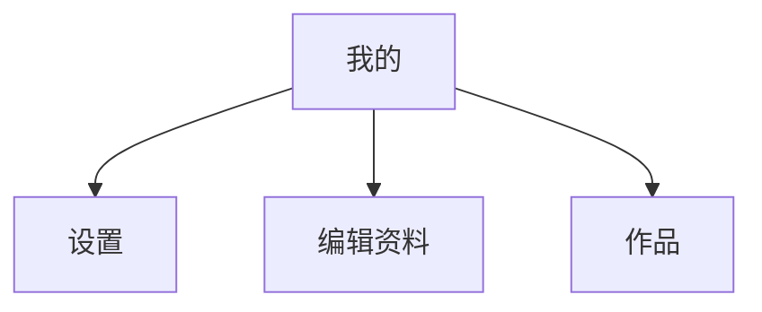
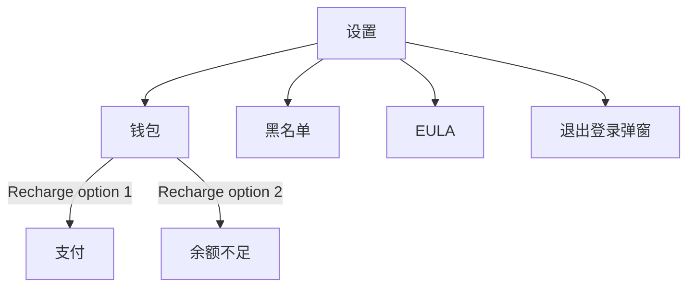
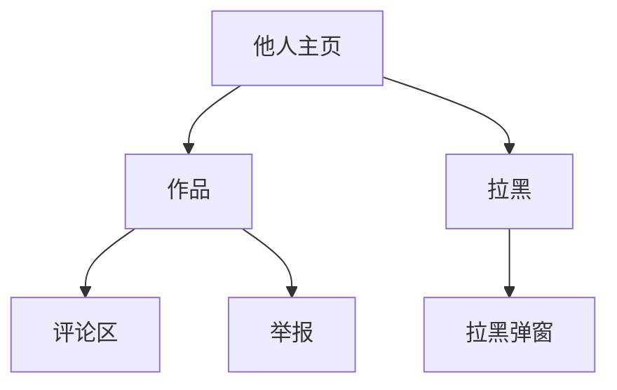

# Morvi Navigation Flow

This document records the current page flow implemented in UIKit.

## Flow Containers

- App root: `FlowShellController`
- Main flow root: `RootTabsController`
- Login/auth pages live in a separate auth `FlowShellController` that is presented from the bottom after an authentication-required action.
- Visible system navigation bars are hidden. All visible top controls are custom layers.
- Main tabs are rendered by `FloatingDockView`, not by `UITabBarController`.

## App Entry



- App launch enters the main flow directly.
- Login/access popup cards are overlays on top of the current main-flow page.
- Tapping `Log in` in the popup closes the overlay and presents a separate auth navigation flow from the bottom.
- The auth navigation root is `EntrySceneController`, so the first presented page is the login/register entry screen.
- Successful auth dismisses the modal auth navigation flow and reveals the existing main-flow page underneath.

## Main Tabs



The tabbar maps to pages as follows:

| Tab asset | Page |
| --- | --- |
| `tab_home` | `首页` |
| `tab_discover` | `发现` |
| `tab_dialogue` | `消息` |
| `tab_persona` | `我的` |

## Home Page

| Trigger | Destination |
| --- | --- |
| Avatar / top leading area | `个人信息` |
| Save your feelings | `发布今日感受` |
| Discover card | Switches to `发现` tab |
| Recot Bot card | `AI聊天` |



## Discover Page

| Trigger | Destination |
| --- | --- |
| My works add button | `上传作品-未上传主题` |
| First story avatar | `他人主页` |
| First feed media card | `作品` |
| First feed comment area | `评论区` |



## Dialogue Page

| Trigger | Destination |
| --- | --- |
| Any dialogue card | `聊天` |



## Persona Page

| Trigger | Destination |
| --- | --- |
| Settings icon / top trailing area | `设置` |
| Edit Profile button | `编辑资料` |
| Any media tile | `作品` |



## Settings Page

| Trigger | Destination |
| --- | --- |
| Wallet row | `钱包` |
| Blacklist row | `黑名单` |
| Privacy Policy row | `EULA` |
| User Agreement row | `EULA` |
| Delete account row | `退出登录弹窗` |
| Log out row | `退出登录弹窗` |



## Detail And Modal Pages

| Source | Trigger | Destination |
| --- | --- | --- |
| `作品` | Comment area | `评论区` |
| `作品` | Top trailing area | `举报` |
| `他人主页` | Media area | `作品` |
| `他人主页` | Top trailing area | `拉黑` |
| `拉黑` | Option area | `拉黑弹窗` |



## Default Back Behavior

- `BaseSceneController` installs a custom top layer on each pushed page.
- The custom leading/back area pops one controller when the navigation stack has more than one controller.
- Modal-style pages in this project are still represented as pushed controllers unless explicitly noted by their route behavior.

## Debug Direct Launch

In DEBUG builds, any `ScenePage.rawValue` can be opened directly with:

```sh
xcrun simctl launch <device-id> com.local.Morvi --scene=<页面名>
```

Example:

```sh
xcrun simctl launch <device-id> com.local.Morvi --scene=首页
```
